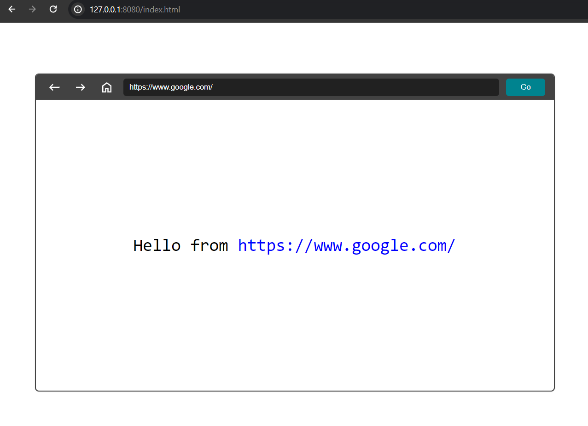

# Browser History Design
This simple web application demonstrates browser history functionality using vanilla HTML, CSS, and JavaScript. The app includes components like an address bar, home button, backward and forward buttons, and a display area for content corresponding to a URL.

## Preview


## Usage
1. **Home page:** The default home page is set to "https://www.google.com". When the app loads or when the home button is clicked, it displays content for this URL.
2. **Visit URL:** Enter a URL in the address bar and press Enter or click on the "Go" button. Instead of opening the web page corresponding to the URL, we'll just display `Hello from {URL}` on the screen.
3. **Navigation Buttons:** Use the backward and forward buttons to navigate between pages, demonstrating the browser history functionality.

## `BrowserHistoryService` Class
The BrowserHistoryService class, defined in "BrowserHistory.service.js", implements the core functionality of the browser history. It includes the following methods:
- `visit(url)`: Displays content for the specified URL.
- `back()`: Navigates to the previous page.
- `forward()`: Navigates to the next page.
The class employs two stack data structures to manage the backward and forward navigation.

## UI Components
The app includes two main UI components:
1. `PageControllerComponent`: This component contains UI elements such as the address bar, home button, backward and forward buttons.
2. `PageComponent`: This component represents the display area for the content corresponding to a URL.

## `MessageChannelService` Class
`MessageChannelService` class is used to facilitate communication between the `PageControllerComponent` and `PageComponent`.

## Local Setup
- Pull this branch into your local system.
- Make sure you have Node installed (preferrably Node v18.17.1).
- Navigate to the project directory and run
```
npm install
```
- Once all the dependencies have been installed, run the following command to build the project.
```
npm run build
```
- Spin up the local server with the following command.
```
npm run start
```
- Copy the `url` from the console. Open the browser and go to the following url.
```
{url}/index.html
```